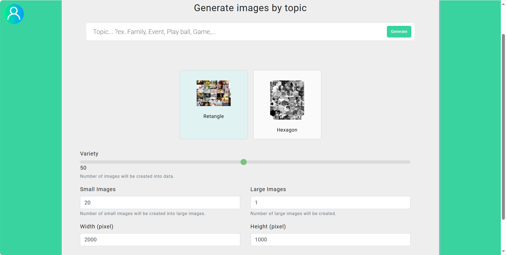
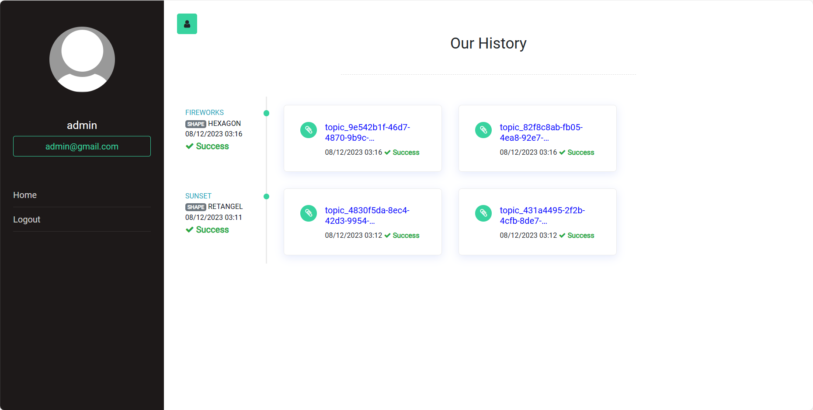

## What it does:

  

  

This JAVA Program takes multiple images from a selects folder and creates with a selectes width and height a random collage. It works with different sized images and different ratio images, so no pre-processing is necessary. Additionally, there are two available shapes to choose from: *Rectangle* and *Hexagon*

  

  

Perfect for creating posters wit A LOT of images and a high quality

  

  

Example results (2000x1500 rectangles):

  

  

(2000x300 rectangles)

  

  

(2000x2rows hexagon)

  

  

(2000x4rows hexagon)

  

  

## Demo:

  **Login Page**

  

**Home Page**

 - Search bar: The topic you want to create an image
 - Variety: Number of images retrieved from the data warehouse to
   generate images
 - Shape: Shape or type of photo you want to create
 - Large images: Number of photos you want to create
 - Small images: Number of small images are merged
 - Width: Image width (pixels)
 - Height: Image Height (pixels->retangel or rows->hexagon)

  

**Profile and Generated Images History**

## How it works:

  

  

ONLY works with JAVA 17

  

  

1. Setup enviroment

2. Import file [picture_collage.sql](https://github.com/hungpham28/generate-art-images/blob/main/sql_data/picture_collage.sql) in MYSQL Database

3. Install web server [tomcat](https://tomcat.apache.org/download-90.cgi)

4. Run on tomcat server

you can build package 'GeneratePictureCollage.war' by hand

  

# How to deploy a war file in Tomcat 7

  

To deploy a WAR (Web ARchive) file in Apache Tomcat 7, you can follow these steps:

  

1. Place the WAR file in the `webapps` directory of your Tomcat installation. The default location is `/usr/local/tomcat/webapps` on Linux and `C:\Program Files\Apache Software Foundation\Tomcat 7.0\webapps` on Windows.

2. Start the Tomcat server if it is not already running.

3. Open a web browser and navigate to `http://localhost:8080/`, where `8080` is the default port number for Tomcat.

4. The WAR file will be automatically deployed and a new folder with the same name as the WAR file will be created in the `webapps` directory. The contents of the WAR file will be extracted to this folder.

5. You can access the web application by appending the context path of the application to the base URL. The context path is the name of the WAR file without the `.war` extension. For example, if the WAR file is named `GeneratePictureCollage.war`, the context path is `/GeneratePictureCollage` and you can access the application at `http://localhost:8080/GeneratePictureCollage/`.

  

Note: These steps assume that you have already installed Tomcat and set it up correctly. If you have not done so, you can follow the instructions in the Tomcat documentation to install and configure Tomcat.